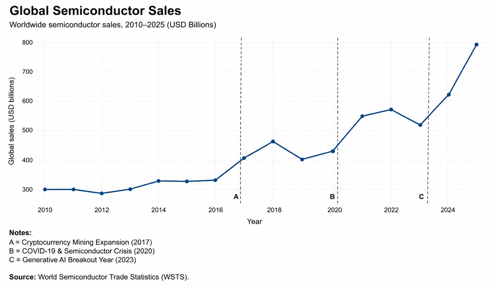
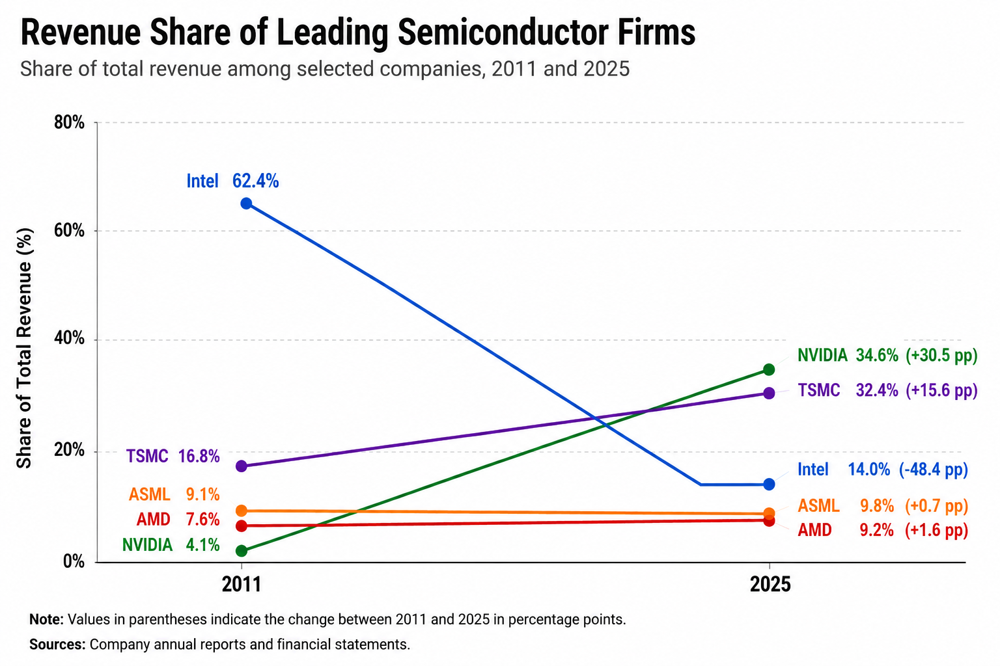
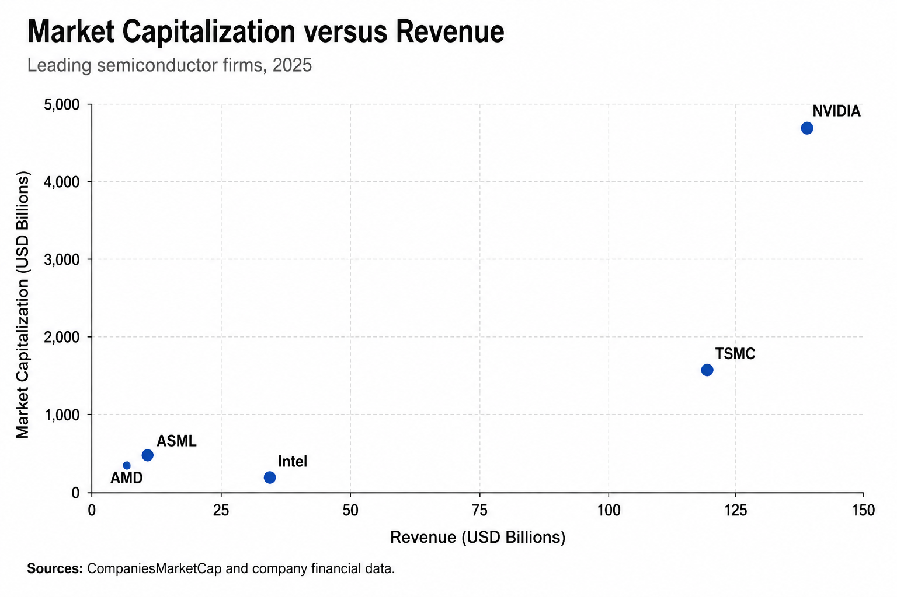

# Global Semiconductor Industry (2010–2025)

An exploratory data analysis of the global semiconductor industry, developed in **R**, covering market growth, regional dynamics, related technology markets, and the evolution of selected leading firms between 2010 and 2025.

The project combines data cleaning, transformation, descriptive analysis, visualization, validation checks, and a full analytical report.

> **Full report:** [`report/semiconductor_industry_2010_2025.pdf`](report/semiconductor_industry_2010_2025.pdf)  
> The report is currently available in Spanish.

---

## Project Overview

The semiconductor industry has become a central component of the global technology economy. This project studies how the sector evolved between 2010 and 2025 through three complementary levels of analysis:

- **Industry level:** global semiconductor sales and major market events.
- **Regional level:** changes in the relative weight of East and West.
- **Firm level:** revenue growth, revenue shares, and market capitalization for NVIDIA, AMD, Intel, TSMC, and ASML.

The analysis also compares semiconductor market growth with two related technology markets: **smartphone shipments** and **global gaming revenues**.

The project is intentionally **exploratory and descriptive**. It identifies trends, structural changes, and visual associations without making causal claims.

---

## Main Questions

The analysis addresses the following questions:

- How much did global semiconductor sales grow between 2010 and 2025?
- How did the regional structure of the industry change?
- How did semiconductor growth compare with smartphones and gaming?
- Did the selected firms benefit equally from industry expansion?
- How did the relative economic weight of the selected firms change?
- How does 2025 market capitalization compare with company revenues?

---

## Key Findings

- Global semiconductor sales increased from approximately **USD 298 billion in 2010** to **USD 796 billion in 2025**.
- East Asia remained the dominant macro-region throughout the period, although its share declined from approximately **69% to 61%**, while the Western share increased.
- Semiconductor sales grew substantially faster than global smartphone shipments over the common comparison period.
- The five selected firms followed very different trajectories. **NVIDIA and TSMC gained substantial relative weight**, while **Intel's share of combined selected-company revenue declined sharply**.
- By 2025, market capitalization differed considerably from current revenue scale, particularly for NVIDIA, illustrating the importance of market expectations, technological positioning, and anticipated future growth.

These results should be interpreted as descriptive evidence rather than causal estimates.

---

## Selected Visualizations

### Global semiconductor sales



### Revenue share transformation among selected firms



### Market capitalization vs. revenue



The repository contains **12 figures in English and 12 in Spanish**.

---

## Companies Analyzed

The firm-level analysis focuses on five strategically relevant companies occupying different positions in the semiconductor value chain:

| Company | Country / Region | Main role |
|---|---|---|
| NVIDIA | United States | Chip design |
| AMD | United States | Chip design |
| Intel | United States | Design and manufacturing |
| TSMC | Taiwan | Semiconductor manufacturing |
| ASML | Netherlands | Lithography equipment |

The sample is selective and is not intended to represent the entire semiconductor industry.

---

## Data Sources

The project combines public, industry, and company-level data.

Main sources include:

- **World Semiconductor Trade Statistics (WSTS)** — global and regional semiconductor sales.
- **International Data Corporation (IDC)** — smartphone market data.
- **Newzoo** — global gaming market revenues.
- **Company annual reports and financial statements** — company revenue data.
- **CompaniesMarketCap** — 2025 market capitalization.
- **OECD, NBER, academic papers, and industry reports** — contextual and supporting literature.

Raw datasets used by the R workflow are stored in [`data/raw/`](data/raw/). Supporting literature and industry reports are available in [`references/`](references/).

---

## Methodology

The workflow includes:

1. Importing and cleaning raw Excel and CSV files.
2. Standardizing units and variable formats.
3. Aggregating WSTS regional data into:
   - **East:** Japan + Asia Pacific
   - **West:** Americas + Europe
4. Constructing growth indices with fixed base years.
5. Comparing semiconductor sales with smartphone and gaming market indicators.
6. Calculating company revenue growth and relative revenue shares.
7. Combining 2025 revenue and market-capitalization data.
8. Generating the 12 analytical visualizations.
9. Running validation checks for years, regional totals, index bases, revenue shares, and market-cap observations.

---

## Reproducibility

The complete R workflow is available at:

[`R/semiconductor_part_A_analysis.R`](R/semiconductor_part_A_analysis.R)

Run the script from the **repository root**.

### Required R packages

```r
install.packages(c(
  "tidyverse",
  "readxl",
  "scales",
  "patchwork",
  "ggrepel"
))
```

Then run:

```r
source("R/semiconductor_part_A_analysis.R")
```

The script reads the raw files from:

```text
data/raw/
```

and regenerates the English figures in:

```text
figures/EN_reconstructed/
```

The workflow also performs validation checks at the end of execution.

---

## Repository Structure

```text
semiconductor-ai-analysis/
├── R/
│   └── semiconductor_part_A_reconstructed.R
│
├── data/
│   └── raw/
│       ├── Historical_Billings_Report.xlsx
│       ├── company_market_cap_2025.csv
│       ├── data_raw_global_semiconductor_firms_revenue_2011_2025.xlsx
│       ├── global_gaming_market_revenue_2012_2025.xlsx
│       └── global_smartphone_shipments_2012_2025.xlsx
│
├── figures/
│   ├── EN/
│   └── ES/
│
├── references/
│   ├── industry_reports/
│   └── papers/
│
├── report/
│   └── semiconductor_industry_2010_2025.pdf
│
├── .gitignore
├── LICENSE
└── README.md
```

---

## Figures

The project contains the following 12 analytical figures:

1. Global semiconductor sales, 2010–2025.
2. Regional semiconductor sales: East vs. West.
3. Regional semiconductor market share.
4. Regional semiconductor sales growth index.
5. Regional market-share comparison: 2010 vs. 2025.
6. Semiconductor, smartphone, and gaming growth indices.
7. Semiconductor sales vs. related technology markets.
8. Revenue growth index for selected firms.
9. Company revenues: 2011 vs. 2025.
10. Revenue-share transformation among selected firms.
11. Market capitalization of selected firms in 2025.
12. Market capitalization vs. revenue in 2025.

---

## Limitations

This project has several important limitations:

- The analysis is descriptive and does not establish causality.
- The company analysis is based on five selected firms rather than the full industry.
- Data originate from different sources and may use different reporting conventions.
- The East/West aggregation is an analytical simplification designed for regional comparison.
- Market capitalization reflects investor expectations and should not be interpreted as a direct measure of operating performance.

---

## Future Extension

A second part of the project is planned to extend the analysis toward **econometric and time-series methods**, with particular attention to trade tensions, technological restrictions, industrial policy, structural breaks, and other major shocks affecting the semiconductor industry.

---

## Author

**Santiago Castillo Marsicano**  
Economist | Sociologist | Data Analytics

GitHub: [SantiagoCMarsicano](https://github.com/SantiagoCMarsicano)

---

## License

This project is distributed under the terms specified in the [`LICENSE`](LICENSE) file.
